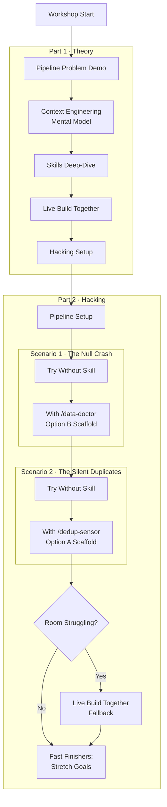

# Context Engineering for Data Engineers — Workshop Outline

**Audience**: Fresh graduates with basic Python. No data engineering, Polars, or pipeline experience. Will have Claude Code pre-configured on OV Bedrock. Care about: feeling competent, seeing practical value, not getting lost in tooling.

**Objective**: After the workshop, participants can explain what a skill is, have felt the difference between raw Claude Code (quick hacks) and skill-informed Claude Code (the Dataminded way), and have completed two working skills they can point to.

---

## The Core Insight

The before/after contrast isn't "broken vs working" — it's "quick hack vs the right way." Raw Claude Code suggests `df.drop_nulls()` and moves on. Skill-informed Claude Code diagnoses root causes, never silently drops data, explains the "why", and validates before loading. The skill encodes Dataminded engineering principles, not just code patterns.

---

## Workshop Flow

---

## Part 1: Theory

### Block 1 — The Pipeline Problem Demo
Live demo: IoT pipeline breaks. Claude Code without a skill suggests `df.drop_nulls()` — quick fix, silently loses data. Same problem with a skill — diagnoses root cause (sensor battery death), preserves raw data, applies the fix the Dataminded way. The skill encodes engineering principles, not just code.

### Block 2 — Context Engineering: The Mental Model
- "A brilliant intern on day one — smart, but doesn't know your stack, your data, or your patterns."
- Three levers: *what info*, *when it appears*, *how it's structured*.
- DE-specific: Claude knows Python, but does it know your team never silently drops rows? Skills encode team principles.
- The spectrum: Raw prompting → CLAUDE.md → Skills → MCP → RAG. Mention DataMindy as the MCP end of the spectrum — skills are the zero-infrastructure version.

### Block 3 — Skills: What They Are and Why They Work
- Skill = markdown file with scoped, reusable context. Frontmatter, instructions, `$ARGUMENTS`, `!command`.
- Skills vs chat instructions: shareable, version-controlled, on-demand.
- Good vs bad: principle-driven skill vs vague "help me with data" prompt.

### Block 4 — Live Build Together
Build a simple data quality skill from scratch. The skill teaches Claude how to check a Polars DataFrame for common issues. Everyone follows along.

### Block 5 — Hacking Setup
Environment check (devcontainer), pipeline walkthrough, exercise overview, Claude Code cheat sheet.

---

## Part 2: Hacking

### The Pipeline
- **Stack**: Python + Polars + DuckDB (all local, no infrastructure)
- **Flow**: Read CSV batch → transform (aggregate, clean) → load into DuckDB → query results
- **Data**: Pre-generated IoT sensor readings (device_id, timestamp, temperature, humidity)
- **Batches**:
  - `batch_1.csv` — Clean. Pipeline works. ✓
  - `batch_2.csv` — Null readings (dying sensor batteries). Pipeline crashes. ✗
  - `batch_3.csv` — Duplicate readings (network retries). Metrics silently inflated. ✗

### Scenario 1: The Null Crash (~45 min)
1. Switch to `batch_2.csv`. Pipeline crashes.
2. **Without skill**: Use raw Claude Code to debug. Claude suggests `drop_nulls()` or fill with zeros — "works" but silently loses data.
3. **With skill**: Complete the `/data-doctor` scaffold (Option B — logic given, sharpen the prompts). Encode Dataminded principles: never silently drop, explain root cause, log removals, validate before loading.
4. Run the skill. Feel the difference.

**Key learning**: Skills encode *how your team thinks*, not just code patterns.

### Scenario 2: The Silent Duplicates (~45 min)
1. Switch to `batch_3.csv`. Pipeline runs but metrics are wrong.
2. **Without skill**: Use raw Claude Code. No crash to debug — harder to find the problem.
3. **With skill**: Complete the `/dedup-sensor` scaffold (Option A — structure given, write the logic). Detect by device_id + timestamp, explain cause (network retries), preserve audit trail.
4. Run the skill. Feel the difference.

**Fallback**: If room struggles, switch to live build-together. No extra prep needed.

**Key learning**: Progressive skill authoring — from editing prompts (scenario 1) to writing logic (scenario 2).

### Stretch Goals
- Combine both into a single `/pipeline-guardian` skill
- Generate `batch_4.csv` with a schema change and build a skill for it
- Benchmark token usage and output quality with vs without skills

---

## Design Decisions

| Decision | Choice | Rationale |
|----------|--------|-----------|
| "Without" baseline | Raw Claude Code (not fully manual) | Realistic — they'll always have Claude Code. The lesson is "with vs without the right context." |
| Pipeline library | Polars | Modern, clean API, weaker Claude Code support = skill shines brighter |
| Database | DuckDB | Zero infrastructure, single pip install, real SQL |
| Data domain | IoT sensors | Naturally messy (nulls, dupes), intuitive, easy to generate |
| Skill content | Dataminded engineering principles | Reusable across any pipeline. Sourced from DataMindy repo. |
| Scaffold progression | Option B → Option A | B (edit prompts) builds confidence, A (write logic) applies the pattern |
| Scenario 2 fallback | Live build-together | Zero extra prep, valid learning experience either way |
| Devcontainer | Built last | Validate content first, containerize after |

---

## Dataminded Principles Encoded in Skills

Sourced from DataMindy (`playground-datamindy` repo):

- **Never silently drop data** — log what's removed and why
- **Explain root causes** — comment the "why", not the "what"
- **Validate before loading** — check data quality before writing to the database
- **You build it, you run it** — operational mindset from the start
- **Automate toil** — if you're doing it twice, encode it in a skill

---

## Prep Checklist

- [ ] IoT sensor data generator script (produces batch_1, batch_2, batch_3)
- [ ] Working pipeline code (Polars + DuckDB)
- [ ] Skill scaffold: `/data-doctor` (Option B — logic given, prompts blank)
- [ ] Skill scaffold: `/dedup-sensor` (Option A — structure given, logic blank)
- [ ] Before/after demo for Block 1, tested on OV Bedrock
- [ ] Pre-recorded backup of the demo
- [ ] Devcontainer with Python, Polars, DuckDB, Claude Code pre-installed
- [ ] Claude Code cheat sheet for beginners
